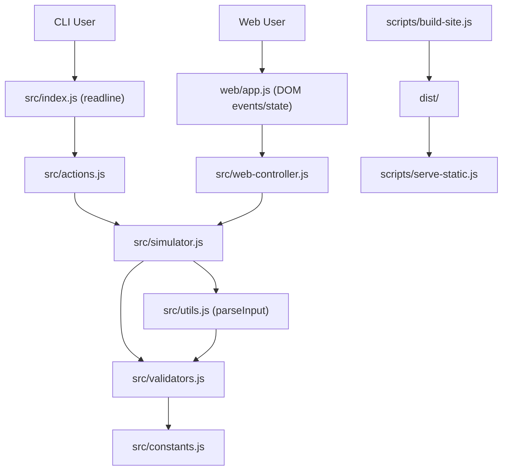

# ToyRobot System Design Review (EN + 繁中)

## 1) Executive Summary (EN)

This project uses a **shared core domain engine** for both CLI and Web UI.

- Core simulation and parsing live in `src/`.
- CLI adapter is `src/index.js` + `src/actions.js`.
- Web adapter is `web/app.js` + `src/web-controller.js`.
- Static deployment concerns are isolated in `scripts/build-site.js`, `scripts/serve-static.js`, and GitHub workflows.

The design is intentionally simple and deterministic, optimized for:

- correctness and predictable state transitions,
- reuse of domain logic across interaction channels,
- easy testability with pure-function boundaries.

---

## 2) 系統總覽（繁中）

本專案採用 **共用核心領域引擎**，同時支援 CLI 與瀏覽器介面。

- 核心模擬與指令解析在 `src/`。
- CLI 介接層在 `src/index.js` 與 `src/actions.js`。
- Web 介接層在 `web/app.js` 與 `src/web-controller.js`。
- 靜態部署與交付責任分離在 `scripts/build-site.js`、`scripts/serve-static.js` 與 GitHub Actions。

此架構刻意維持簡潔與可預測，重點是：

- 狀態轉移正確且可重現，
- 核心規則可跨介面重用，
- 函式邊界清楚，測試成本低。

---

## 3) Architecture (EN)

### Layering

1. **Domain layer** (`src/simulator.js`, `src/utils.js`, `src/validators.js`, `src/constants.js`)
2. **Interface adapters**
- CLI: `src/index.js`, `src/actions.js`
- Web: `web/app.js`, `src/web-controller.js`
3. **Delivery/runtime layer** (`scripts/*.js`, `.github/workflows/*`)

### Key boundary decision

`runCommand(input, state)` is the core contract. Both CLI and Web call it, so behavior stays consistent across channels.

---

## 4) 架構重點（繁中）

### 分層策略

1. **領域層**：`src/simulator.js`、`src/utils.js`、`src/validators.js`、`src/constants.js`
2. **介接層**：
- CLI：`src/index.js`、`src/actions.js`
- Web：`web/app.js`、`src/web-controller.js`
3. **交付/執行層**：`scripts/*.js`、`.github/workflows/*`

### 關鍵邊界設計

核心契約是 `runCommand(input, state)`，CLI 與 Web 都走同一條規則路徑，避免「兩套邏輯」導致行為不一致。

---

## 5) Tradeoffs (EN)

## 5.1 Chosen architecture: Shared engine + thin adapters

**Why chosen**
- Eliminates duplicated command rules.
- Improves test leverage (domain tests cover both UIs).
- Simplifies bug fixes: one fix propagates everywhere.

**Tradeoffs accepted**
- UI-specific optimizations must still pass through domain boundaries.
- Result object shape (`status/message/reportOutput`) becomes a shared contract that can constrain future UI changes.

## 5.2 Stateless command execution with explicit state input/output

**Why chosen**
- `runCommand` is deterministic and easy to unit test.
- No hidden global state in domain functions.

**Tradeoffs accepted**
- Callers must manage state lifecycle themselves (CLI/Web each hold their own `state`).

## 5.3 Script parsing and validation in dedicated modules

**Why chosen**
- Parsing concerns (`src/utils.js`) and rule checks (`src/validators.js`) are separable.
- Easier to expand validation policies without touching movement logic.

**Tradeoffs accepted**
- Extra indirection for a small project.

---

## 6) 架構取捨（繁中）

### 6.1 共用引擎 + 薄介接層

**選擇原因**
- 避免 CLI/Web 各自實作規則而漂移。
- 測試覆蓋可集中在領域層，投資報酬高。
- 修 bug 只改一處。

**代價**
- UI 端需求若偏特化，仍要維持核心契約一致。
- 回傳格式一旦被多端依賴，演進需顧及相容性。

### 6.2 顯式狀態輸入/輸出（接近純函式）

**選擇原因**
- 可預測、可測試、可重播。

**代價**
- 呼叫端（CLI/Web）要自己管理 state 生命週期。

### 6.3 解析與驗證分離

**選擇原因**
- 責任分工清楚，後續擴充規則時風險較低。

**代價**
- 對小型專案來說模組數稍多。

---

## 7) Data Structures: Why these choices, alternatives, and tradeoffs

### 7.1 Robot state object

**Current**
- Plain object in `src/simulator.js`:
  - `{ x, y, f, Placed }`

**Why this works**
- Small, explicit fields; very low cognitive overhead.
- Easy shallow copy with spread (`{ ...state }`) for immutable-style updates.

**Alternatives**
1. Tuple/array `[x, y, f, placed]`
- Pros: compact.
- Cons: poor readability; index mistakes likely.
2. Class `RobotState`
- Pros: encapsulation/invariants.
- Cons: heavier API, more ceremony for simple transitions.
3. `Map`
- Pros: dynamic keys.
- Cons: unnecessary overhead for fixed schema.

### 7.2 Command and direction collections

**Current**
- Arrays in `src/constants.js`:
  - `Commands = ["PLACE", "MOVE", "LEFT", "RIGHT", "REPORT"]`
  - `Directions = ["NORTH", "EAST", "SOUTH", "WEST"]`

**Why this works**
- Tiny fixed set; `.includes` is clear and sufficient.
- Ordered `Directions` enables rotation by index arithmetic.

**Alternatives**
1. `Set`
- Pros: O(1) membership check semantics.
- Cons: loses direct ordering usefulness for turning unless paired with another structure.
2. Enum-like object `{ NORTH: 0, ... }`
- Pros: explicit constants, easy serialization.
- Cons: extra mapping logic for rotation/output strings.

### 7.3 Direction rotation logic

**Current**
- Array index + modulo in `turn()`.

**Why this works**
- Very compact, mathematically robust for cyclic order.

**Alternatives**
1. Lookup table object:
- `LEFT[NORTH] = WEST`, etc.
- Pros: explicit transitions, easy to read.
- Cons: duplication and maintenance overhead.
2. Vector math (`dx`, `dy` rotation)
- Pros: extensible for richer movement engines.
- Cons: overkill for cardinal-only toy robot.

### 7.4 PLACE parameter parsing

**Current**
- Regex `PLACE_PARAM_PATTERN` in `src/utils.js`.

**Why this works**
- Enforces exact structure in one step.
- Pairs with validator for numeric range and direction safety.

**Alternatives**
1. `split(',')` + manual checks
- Pros: straightforward.
- Cons: more branchy logic and edge-case handling.
2. Parser combinator library
- Pros: scalable grammar parsing.
- Cons: dependency overhead not justified.

### 7.5 Board representation for Web

**Current**
- Recomputed flat `cells[]` array in `getBoardCells()`.

**Why this works**
- Simple render model for DOM mapping (`.map().join('')`).
- Board size is fixed and tiny (36 cells), so recompute cost is negligible.

**Alternatives**
1. 2D array `cells[y][x]`
- Pros: natural grid semantics.
- Cons: extra flattening for templating.
2. Sparse map keyed by `"x,y"`
- Pros: useful for large sparse boards.
- Cons: unnecessary complexity for fixed dense 6x6.

### 7.6 Script commands list

**Current**
- `scriptCommands: string[]` + `scriptCursor: number` in `web/app.js`.

**Why this works**
- Efficient stepping/running with stable ordering.

**Alternatives**
1. Queue structure
- Pros: natural consume semantics.
- Cons: destructive by default; harder to reset cursor/preview.
2. Linked list
- Pros: cheap head removal.
- Cons: poor fit for random indexing/highlighting.

### 7.7 Preset storage

**Current**
- Plain object map `presetStore[key] = { label, commands }`.

**Why this works**
- O(1) key access; simple dynamic insertion for custom presets.

**Alternatives**
1. Array of presets
- Pros: easy iteration.
- Cons: lookup by key needs search.
2. `Map`
- Pros: explicit key-value API.
- Cons: serialization ergonomics and extra complexity not needed.

---

## 8) Deep-dive Questions Prep (EN)

1. Why centralize command execution in `runCommand` instead of handling logic directly in UI layers?
- To prevent rule drift between CLI/Web and maximize test reuse.

2. Why keep `runCommand` state-in/state-out instead of mutating internal singleton state?
- Deterministic behavior, easier replay, simpler unit tests.

3. Why parse input first and validate second?
- Syntax normalization and semantic checks are separate concerns; this keeps error messages precise.

4. Why is movement boundary checking in simulator logic instead of validators?
- It depends on the current runtime state (`x`, `y`, `f`), not static input alone.

5. Why use array+modulo for turning?
- It provides concise cyclic transitions with minimal branching.

6. If grid size changes (e.g., 10x10), what changes are required?
- Update `Table` constants; board rendering and validation already reference them.

7. How would you support obstacles?
- Add occupancy structure (e.g., `Set` of blocked coordinates) and collision check in `move()`.

8. How would you support lowercase commands safely?
- Normalize command casing in parse layer, keep domain constants uppercase.

9. Why is board derived data recomputed every render?
- 36-cell fixed board makes recomputation simpler than maintaining diff state.

10. How to avoid breaking consumers when changing result shape?
- Add versioned adapter or additive fields; keep current keys backward compatible.

11. Why avoid classes here?
- Functional core keeps behavior transparent and testable with less ceremony.

12. How to extend commands (e.g., `UNDO`)?
- Add command constant, parse handling, simulator branch, and history store at adapter layer or domain wrapper.

13. Why does invalid command not stop simulation?
- Matches problem constraints and improves UX resilience in scripted runs.

14. What are current reliability strengths?
- Strong unit coverage in parsing/simulator/web-controller/server modules.

15. Biggest architecture risk if scope grows?
- Contract coupling (`status/message` text semantics) and monolithic `web/app.js` size.

16. How would you refactor `web/app.js` for scale?
- Split into view renderer, event binding, and UI state store modules.

17. Why no persistent storage for presets?
- Current scope favors in-memory simplicity; persistence can be added via localStorage adapter.

18. How would you internationalize messages?
- Replace hardcoded strings with message catalog keyed by status/error codes.

19. Why is static server custom instead of framework?
- Minimal dependency footprint and explicit security header control for this project size.

20. What metrics would you track after architecture changes?
- Test pass rate, defect escape rate, Lighthouse score trend, and command latency in browser.

---

## 9) 深入問答準備（繁中）

1. 為何要把指令執行集中在 `runCommand`？
- 避免 CLI/Web 規則分叉，並共用測試資產。

2. 為何採用 state-in/state-out，而不是全域可變狀態？
- 可預測、可重播、可測試。

3. 為何解析與驗證拆開？
- 語法與語意責任不同，錯誤訊息更精準。

4. 為何邊界檢查放在 `move()` 而非 validators？
- 邊界判斷依賴當下座標與朝向，屬於執行期規則。

5. 為何旋轉使用陣列索引 + modulo？
- 簡潔且穩健，避免大量 if/switch 分支。

6. 若棋盤從 6x6 擴到 10x10，要改哪些地方？
- 主要改 `Table` 常數；驗證與渲染已依賴該常數。

7. 若要加障礙物，會怎麼設計？
- 加入障礙座標集合（例如 `Set`），在 `move()` 增加碰撞檢查。

8. 若要支援小寫指令？
- 在 parse 層正規化大小寫，領域層維持單一 canonical 值。

9. 為何每次重算整個 board cells？
- 固定 36 格，重算成本低、邏輯更簡單。

10. 要改回傳格式如何避免破壞既有介面？
- 優先 additive 變更或加 adapter，維持舊欄位相容。

11. 為何不使用 class？
- 目前功能下，函式式核心更透明、樣板更少。

12. 如果新增 `UNDO` 指令？
- 擴充命令常數/解析/執行分支，並在上層加入歷史紀錄資料結構。

13. 為何錯誤指令不中止流程？
- 符合題目要求，也提升腳本連跑容錯性。

14. 目前可靠性優勢是什麼？
- 解析、模擬器、web controller、static server 都有單元測試覆蓋。

15. 規模變大時最大風險？
- `status/message` 契約耦合與 `web/app.js` 過大。

16. `web/app.js` 如何拆分？
- 切成 renderer、event binder、UI state store 三層。

17. 為何 custom preset 不持久化？
- 目前以簡單性優先；可後續加 localStorage adapter。

18. 如何做多語系訊息？
- 將錯誤/狀態字串改為 code + i18n 字典映射。

19. 為何採自製 static server 而非框架？
- 依賴少、可精準控制 header，符合現階段規模。

20. 架構調整後要追哪些指標？
- 測試通過率、漏網缺陷率、Lighthouse 趨勢、瀏覽器指令延遲。

---

## 10) Practical Improvement Backlog (Optional, no business-logic change)

1. Introduce typed result codes (`ERR_INVALID_CMD`, etc.) while keeping current messages for backward compatibility.
2. Split `web/app.js` into modules to reduce coupling and improve maintainability.
3. Add a contract test suite that runs shared command scenarios against both CLI adapter and Web adapter.
4. Add architecture decision records (ADRs) under `docs/adr/` for major choices.

